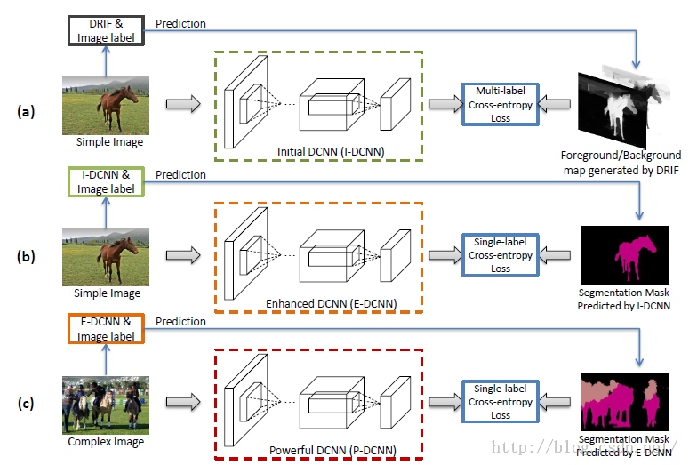

#### 论文是作为组内论文报告为大家讲述的，现在将一些重要思想摘录如下。

# 摘要

论文题目是STC，即Simple to Complex的一个框架，使用弱标签（image label）来解决密集估计（语义分割）问题。
整体来看，理论创新倒是不怎么强，但是在Pipeline的道路上倒是有些新意。

2014年末以来，半监督的语义分割层出不穷，究其原因还是因为pixel级别的GroundTruth太难标注，因此若监督成了人们研究的一个热门方向。

# 主要思想

作者的核心思想是提出了层层递进的三个DCNN，用前一个CNN的结果来作为下一个CNN的结果。

具体来讲，作者一共训练了三个网络：Initial DCNN、Enhanced DCNN和Powerful DCNN。分别解释如下：

- Initial DCNN：

	其实可以把它当作是一个有显著性检测功能的CNN，但“它”能够知道显著性的物体是什么。具体实现是由DRIF方法生成Saliency Map，再结合Image level label，来训练网络。
	
- Enhanced DCNN：
	这一层主要是用来refine每一个物体的分割模版。由于I-DCNN在训练过程中，使用DRIF会有很大噪声，因此这时候就需要我们的“弱标签”出场了。
	说白了，这个DCNN就是对上一个的一个refine。
	
- Powerful DCNN:

	有了上述简单图像的分割之后，我们需要对复杂的多目标的图像进行分割了，这时候，以E DCNN生成的结果作为P DCNN的GroundTruth来训练P DCNN。

这样，我们就得到了最终的网络：P DCNN。附流程图如下：

	
	
	
##Tips:

- 文章中的Simple Images是来自于自建的Flickr Clean数据集。Complex Images是来自于Pascal VOC的train_aug.

#参考文献：

- Wei Y, Liang X, Chen Y, et al. STC: A Simple to Complex Framework for Weakly-supervised Semantic Segmentation[J]. arXiv preprint arXiv:1509.03150, 2015.